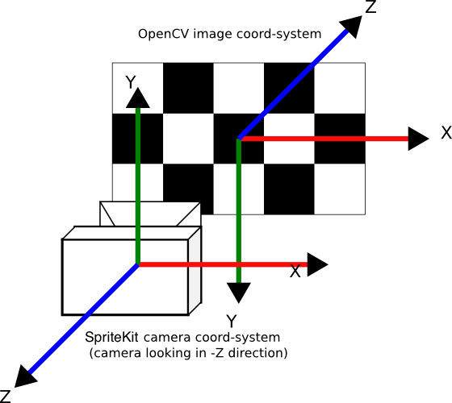

- [対象読者](#対象読者)
- [この記事の範囲](#この記事の範囲)
- [カメラキャリブレーション (camera calibration) とは](#カメラキャリブレーション-camera-calibration-とは)
- [カメラキャリブレーションに必要なもの](#カメラキャリブレーションに必要なもの)
  - [OpenCVとは](#opencvとは)
  - [カメラキャリブレーション用パターンのあれこれ](#カメラキャリブレーション用パターンのあれこれ)
- [キャリブレーションを理解するための専門用語](#キャリブレーションを理解するための専門用語)
- [歪みの補正について詳しく](#歪みの補正について詳しく)
- [ワールド座標系とカメラ座標系について詳しく](#ワールド座標系とカメラ座標系について詳しく)
  - [座標とは](#座標とは)
  - [ワールド座標系とカメラ座標系](#ワールド座標系とカメラ座標系)
- [内部パラメーターと外部パラメーターーについて詳しく](#内部パラメーターと外部パラメーターーについて詳しく)
- [OpenCVを使用したキャリブレーションの手順](#opencvを使用したキャリブレーションの手順)
- [実装](#実装)
  - [各パラメーターを算出して保存する例](#各パラメーターを算出して保存する例)
  - [保存されたパラメーターから、歪の補正を行う例](#保存されたパラメーターから歪の補正を行う例)
- [まとめ](#まとめ)

## 対象読者
- 画像処理をこれから学ぶ学生の方
- カメラキャリブレーションについて理解が曖昧な人
- 概要を知っている必要がある人（例: 営業の方）

## この記事の範囲
具体的な数学には触れません。カメラキャリブレーションの基本的な概念を理解することを目的としています。またカメラキャリブレーションをすることにより、何が得られるかにも触れます。

## カメラキャリブレーション (camera calibration) とは
私達は3次元に住んでいますが、カメラから得られる画像は2次元です。

画像処理の目的の1つとして、カメラから得られる画像を3次元の情報に変換することがあります。
（ロボティクスだったり、姿勢推定だったり、ARだったり）

変換を行うためには、カメラの特性を正確に知る必要があります。このようなカメラの特性を正確に知るための手続きを「カメラキャリブレーション」と言います。

**カメラキャリブレーションとは、`カメラで撮影した画像を「正確に」解釈するための手続き`と考えてください。**

## カメラキャリブレーションに必要なもの
1. **OpenCVプログラム**：キャリブレーションを行うためのプログラム。OpenCVにはキャリブレーションに関する便利な関数が多数用意されています。
2. **キャリブレーションパターンの紙**：チェスボードのような特定のパターンが印刷された紙。このパターンをカメラで撮影し、その画像を解析することでキャリブレーションを行います。画像は最低10枚必要です。
### OpenCVとは
OpenCVとは、画像処理や機械学習などの機能を提供する高度なライブラリで、非常に広く使われています。
### カメラキャリブレーション用パターンのあれこれ
印刷するパターンには、色々なパターンがあります。
- チェスボード
  - エグザンプルとしてもっとも一般的です。
  - 回転不変であるためには、行数が偶数で列数が奇数であるか、その逆である必要があります。
- サークルグリッド
  - より厳密にキャリブレーションを行うためには、サークルグリッドを使用することが推奨されます。
- ArUcoやChArUco
  - 厳密にカメラキャリブレーションを行えます。
  - 
## キャリブレーションを理解するための専門用語
キャリブレーションを理解するためには、以下の専門用語を知る必要があります。
1. **レンズの歪みとその補正**：
   - カメラのレンズは、中心部と端部で光の屈折率が異なるため、画像が歪むことがあります。この歪みを正すことを「歪みの補正」と言います。
   - ノートPCのカメラや市販のWEBカメラは、だいたい広角気味に歪んでいます。

2. **ワールド座標系とカメラ座標系**：
   - ワールド座標系は、実際の物体の位置や姿勢を示す座標系です。一方、カメラ座標系は、カメラの位置や向きを基準とした座標系です。

3. **内部パラメーター (Intrinsic Parameters)**：
   - カメラの特性を示すパラメーター。焦点距離やセンサーの中心位置などがこれに該当します。

4. **外部パラメーター (Extrinsic Parameters)**：
   - カメラの位置や向きを示すパラメーター。ワールド座標系とカメラ座標系の関係を示すために使用されます。

## 歪みの補正について詳しく
カメラのレンズは球状であり、この形状によって画像の端部が歪むことがあります。広角レンズなどを使用すると、この歪みが顕著になります。
> 
> [レンズの歪曲収差と対応方法(5)](https://tokai-kaoninsho.com/%E3%82%B3%E3%83%A9%E3%83%A0/%E6%AD%AA%E3%82%93%E3%81%A0%E5%86%99%E7%9C%9F%E3%81%AE%E8%A3%9C%E6%AD%A3/)から引用

OpenCVでは、これらの歪みを補正するための関数が提供されています。具体的には、`cv2.undistort()`関数を使用することで、歪みの補正を行うことができます。

## ワールド座標系とカメラ座標系について詳しく

参考: [Learn Camera Calibration in Python with OpenCV: Complete Step-by-Step Guide with Python Script](https://www.youtube.com/watch?v=3h7wgR5fYik&t=1066s)
### 座標とは
物の位置を数値で表すための「基準」。地図なら、経度と緯度を指定すると、特定の地点が表現できますね。3次元空間なら、[x, y, z]のように表現できます。
### ワールド座標系とカメラ座標系
カメラで物を撮影すると、3Dの実世界の情報が2Dの画像平面に投影されて画像が形成されます。

この2Dの画像から、物の「実際の位置や姿勢」を知りたいとき、どうすればいいでしょうか？

カメラ（とくにレンズ）の特性（歪みなど）も分からなければ、対象物がカメラから何mm離れているかも分かりませんね。お手上げです。

**そこで、あらかじめ大きさや並び方が分かっている物体を撮影し、その画像からゴニョゴニョと計算をすることで、カメラの特性やカメラの位置や向きや物体との距離が分かります。**

これにより、内部パラメーターと外部パラメーターを求めることができます。

> 「あらかじめ大きさや並び方が分かっている物体」にはいくつかあって、一番ポピュラーな例として「チェスボード」が用いられます。
> 
> ゴニョゴニョと計算する時に、チェスボードの「内角の数」をコード中に指定します。「内角の数」とは、実際にチェスボードのマス目の交差点（コーナー）の数のことで、7x10のマス目のチェスボードがある場合、内角（コーナー）の数は6x9になります。
> 
> マス目の大きさは関係ありません。すべて同じ大きさであれば問題ありません。

[stackoverflow](https://stackoverflow.com/questions/44008003/camera-pose-estimation-from-homography-or-with-solvepnp-function)から引用

## 内部パラメーターと外部パラメーターーについて詳しく

内部パラメーターは、カメラ自体の特性を示すパラメーターです。これには、焦点距離やセンサーの中心位置などが含まれます。これらのパラメーターは、カメラのモデルやレンズの種類によって異なります。

外部パラメーターは、カメラの位置や向きを示すパラメーターです。これには、カメラの位置や姿勢、ワールド座標系との関係などが含まれます。

## OpenCVを使用したキャリブレーションの手順
1. **キャリブレーションパターンの撮影**：
   - キャリブレーションパターン（例：チェスボード）を印刷し、それを様々な角度や位置からカメラで撮影します。この際、パターンが画像全体にきれいに映るように注意します。

2. **コーナーの検出**：
   - 撮影した画像から、キャリブレーションパターンのコーナーの位置を検出します。OpenCVの`cv2.findChessboardCorners()`関数を使用することで、この検出を自動的に行うことができます。

3. **キャリブレーションの実行**：
   - `cv2.calibrateCamera()`関数を使用して、キャリブレーションを行います。この関数には、検出したコーナーの位置やワールド座標系の点を入力として与えることで、内部パラメーターや外部パラメーターを求めることができます。

4. **歪みの補正**：
   - 得られたキャリブレーションパラメーターを使用して、撮影した画像の歪みを補正します。`cv2.undistort()`関数を使用することで、この補正を行うことができます。

5. **パラメーターの保存**：
   - キャリブレーションで得られたパラメーターを保存します。これにより、後で同じカメラを使用する際に、再度キャリブレーションを行う必要がなくなります。

## 実装
### 各パラメーターを算出して保存する例
https://github.com/yKesamaru/webcam_calibration/blob/ac570cff494e68c44770523022eca22ca091fae6/calibration.py#L1-L48

### 保存されたパラメーターから、歪の補正を行う例
https://github.com/yKesamaru/webcam_calibration/blob/6e7f18700b1784c4067cb7f903a989a383b6c17a/correct_lens_distort.py#L1-L21

## まとめ
もし使用するカメラのキャリブレーションをしない場合、そのカメラに映った物体の位置や姿勢を正確に知ることはできません。また、歪みの補正も行うことができません。

画像が歪んでしまっていては、不良品の検出や、ロボットの姿勢推定などができません。カメラキャリブレーションは、画像処理を行う上で、とても重要な手順です。

ただし、すべてのカメラに対してキャリブレーションを行う必要はありません。
前回の記事「頭部姿勢推定を簡易実装する」では、「キャリブレーションを行わずに、頭部姿勢推定をする」ことがテーマでした。現場では、キャリブレーションできないこともままあります。

どうしてもキャリブレーションが必要なシーンで、なぜ、どうしてこの作業が必要なのか、説明できるようになるといいですね。

以上です。ありがとうございました。