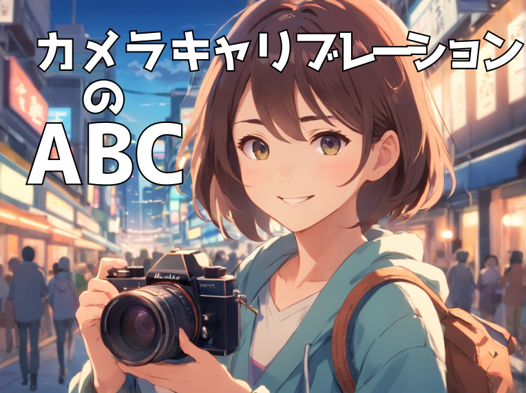
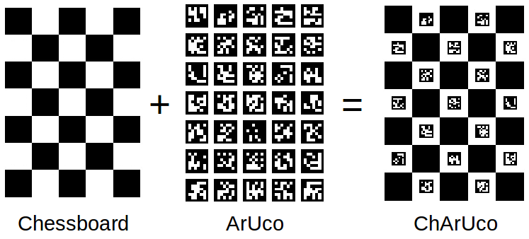
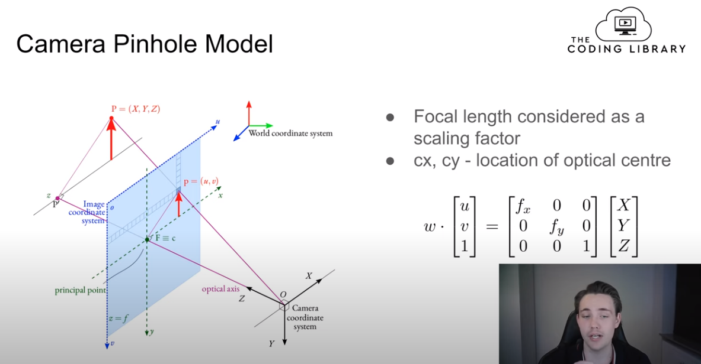

# カメラキャリブレーションのABC: 知っておきたい基本

## 対象読者
- 画像処理をこれから学ぶ人
- カメラキャリブレーションについて理解が曖昧な人
- 概要を知っている必要がある人（例: 営業）

## この記事の範囲
具体的な数学には触れません。カメラキャリブレーションの基本的な概念を理解することを目的としています。またカメラキャリブレーションをすることにより、何が得られるかにも触れます。

## カメラキャリブレーション (camera calibration) とは
私達は3次元に住んでいますが、カメラから得られる画像は2次元です。
画像処理の目的の1つとして、カメラから得られる画像を3次元の情報に変換することがあります。変換を行うためには、カメラの特性を正確に知る必要があります。このようなカメラの特性を正確に知るための手続きを「カメラキャリブレーション」と言います。
カメラキャリブレーションとは、`カメラで撮影した画像を「正確に」解釈するための手続き`と考えてください。

## カメラキャリブレーションに必要なもの
1. **OpenCVプログラム**：キャリブレーションを行うためのプログラム。OpenCVにはキャリブレーションに関する便利な関数が多数用意されています。
2. **キャリブレーションパターンの紙**：チェスボードのような特定のパターンが印刷された紙。このパターンをカメラで撮影し、その画像を解析することでキャリブレーションを行います。画像は最低10枚必要です。
### OpenCVとは
OpenCVとは、画像処理や機械学習などの機能を提供する高度なライブラリで、非常に広く使われています。
### カメラキャリブレーション用パターンのあれこれ
印刷するパターンには、色々なパターンがあります。
- チェッカーボード
  - エグザンプルとしてもっとも一般的です。
  - 回転不変であるためには、行数が偶数で列数が奇数であるか、その逆である必要があるそうです。
- サークルグリッド
  - より厳密にキャリブレーションを行うためには、サークルグリッドを使用することが推奨されます。
- ArUcoやChArUco
  - 厳密にカメラキャリブレーションを行えます。
  - 
## キャリブレーションを理解するための専門用語
キャリブレーションを理解するためには、以下の専門用語を知る必要があります。
1. **レンズの歪みとその補正**：
   - カメラのレンズは、中心部と端部で光の屈折率が異なるため、画像が歪むことがあります。この歪みを正すことを「歪みの補正」と言います。

2. **ワールド座標系とカメラ座標系**：
   - ワールド座標系は、実際の物体の位置や姿勢を示す座標系です。一方、カメラ座標系は、カメラの位置や向きを基準とした座標系です。

3. **内部パラメーター (Intrinsic Parameters)**：
   - カメラの特性を示すパラメーター。焦点距離やセンサーの中心位置などがこれに該当します。

4. **外部パラメーター (Extrinsic Parameters)**：
   - カメラの位置や向きを示すパラメーター。ワールド座標系とカメラ座標系の関係を示すために使用されます。

## 歪みの補正について詳しく
カメラのレンズは球状であり、この形状によって画像の端部が歪むことがあります。広角レンズなどを使用すると、この歪みが顕著になります。
> 
> 
> [レンズの歪曲収差と対応方法(5)](https://tokai-kaoninsho.com/%E3%82%B3%E3%83%A9%E3%83%A0/%E6%AD%AA%E3%82%93%E3%81%A0%E5%86%99%E7%9C%9F%E3%81%AE%E8%A3%9C%E6%AD%A3/)から引用

OpenCVでは、これらの歪みを補正するための関数が提供されています。具体的には、`cv2.undistort()`関数を使用することで、歪みの補正を行うことができます。

## ワールド座標系とカメラ座標系について詳しく

参考: [Learn Camera Calibration in Python with OpenCV: Complete Step-by-Step Guide with Python Script](https://www.youtube.com/watch?v=3h7wgR5fYik&t=1066s)
### 座標
物の位置を数値で表すための「基準」。地図なら、軽度と緯度を指定すると、特定の地点が表現できますね。3次元空間なら、[x, y, z]のように表現できます。
### ワールド座標系とカメラ座標系
カメラで物を撮影すると、3Dの実世界の情報が2Dの画像平面に投影されて画像が形成されます。この2Dの画像から、物の「実際の位置や姿勢」を知りたいとき、まずカメラ座標系を用いて2Dの画像上の点を3Dのカメラ座標系上の点に変換します。その後、カメラ座標系からワールド座標系への変換を行い、物の実世界での位置や姿勢を求めます。
カメラ座標系は、カメラの中心（通常、レンズの中心やカメラの焦点とされる点）を原点とする3Dの座標系、ワールド座標系は、実世界における特定の参照点（例えば、部屋の一つの角や地面の特定の地点など）を原点とする3Dの座標系です。この座標系は、物体や人の実際の位置や姿勢を表すための「大きな基準」として使用されます。ワールド座標系を設定することで、カメラや他のセンサーから得られるデータを実世界のスケールや位置に関連付けることができます。
これらの関係を表す行列式を「外部パラメーター行列」といいます。

キャリブレーションの目的は、これらの座標系の関係を明確にすることです。

## 内部パラメータと外部パラメータについて詳しく

内部パラメータは、カメラ自体の特性を示すパラメータです。これには、焦点距離やセンサーの中心位置などが含まれます。これらのパラメータは、カメラのモデルやレンズの種類によって異なります。

外部パラメータは、カメラの位置や向きを示すパラメータです。これには、カメラの位置や姿勢、ワールド座標系との関係などが含まれます。これらのパラメータは、撮影のたびに異なる可能性があります。

OpenCVでは、`cv2.calibrateCamera()`関数を使用して、これらのパラメータを求めることができます。この関数は、キャリブレーションパターンの画像を入力として、内部パラメータや外部パラメータを出力として返します。

## OpenCVを使用したキャリブレーションの手順
## キャリブレーションを行うための基本的な手順
1. **キャリブレーションパターンの撮影**：
   - キャリブレーションパターン（例：チェスボード）を印刷し、それを様々な角度や位置からカメラで撮影します。この際、パターンが画像全体にきれいに映るように注意します。

2. **コーナーの検出**：
   - 撮影した画像から、キャリブレーションパターンのコーナーの位置を検出します。OpenCVの`cv2.findChessboardCorners()`関数を使用することで、この検出を自動的に行うことができます。

3. **キャリブレーションの実行**：
   - `cv2.calibrateCamera()`関数を使用して、キャリブレーションを行います。この関数には、検出したコーナーの位置やワールド座標系の点を入力として与えることで、内部パラメータや外部パラメータを求めることができます。

4. **歪みの補正**：
   - 得られたキャリブレーションパラメータを使用して、撮影した画像の歪みを補正します。`cv2.undistort()`関数を使用することで、この補正を行うことができます。

5. **パラメータの保存**：
   - キャリブレーションで得られたパラメータを保存します。これにより、後で同じカメラを使用する際に、再度キャリブレーションを行う必要がなくなります。

### キャリブレーションの注意点

キャリブレーションを行う際には、以下の点に注意することが重要です。

- **撮影環境**：キャリブレーションを行う際の撮影環境（照明や背景など）は、後で実際に撮影を行う環境とできるだけ近いものにすることが望ましいです。
- **撮影枚数**：キャリブレーションの精度を高めるためには、多くの画像を使用することが推奨されます。異なる角度や位置からの画像を多数撮影することで、より正確なキャリブレーションが可能となります。

